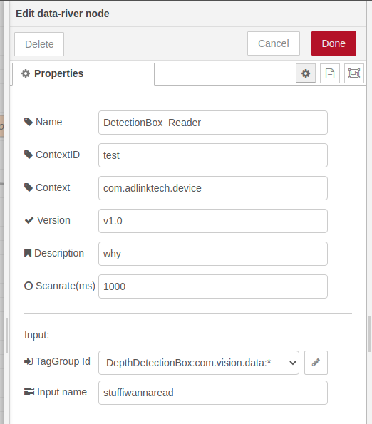
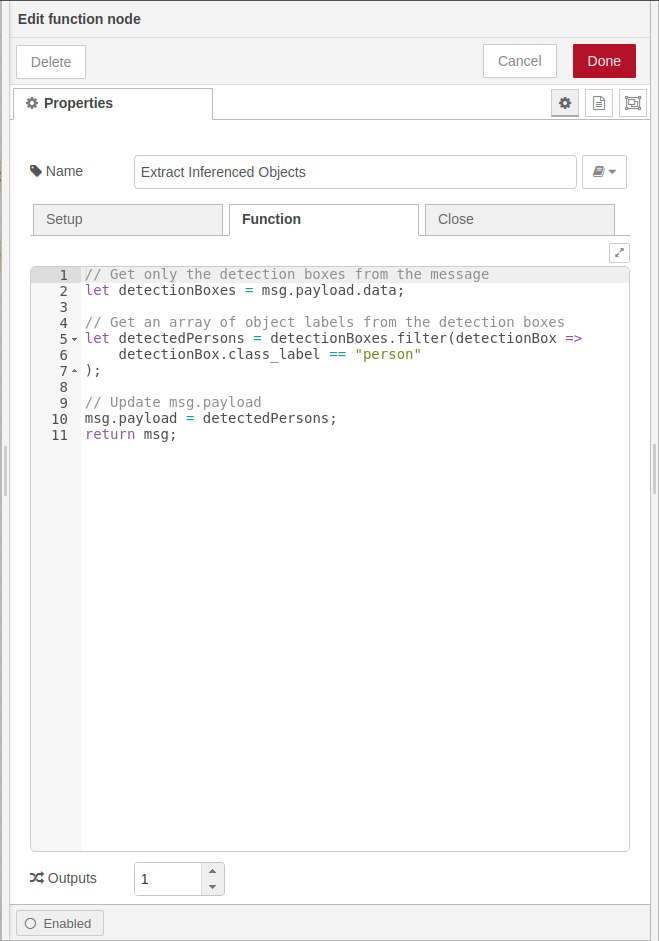
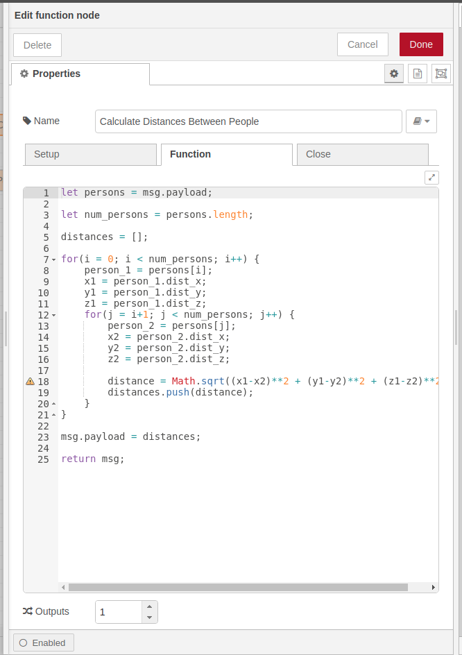
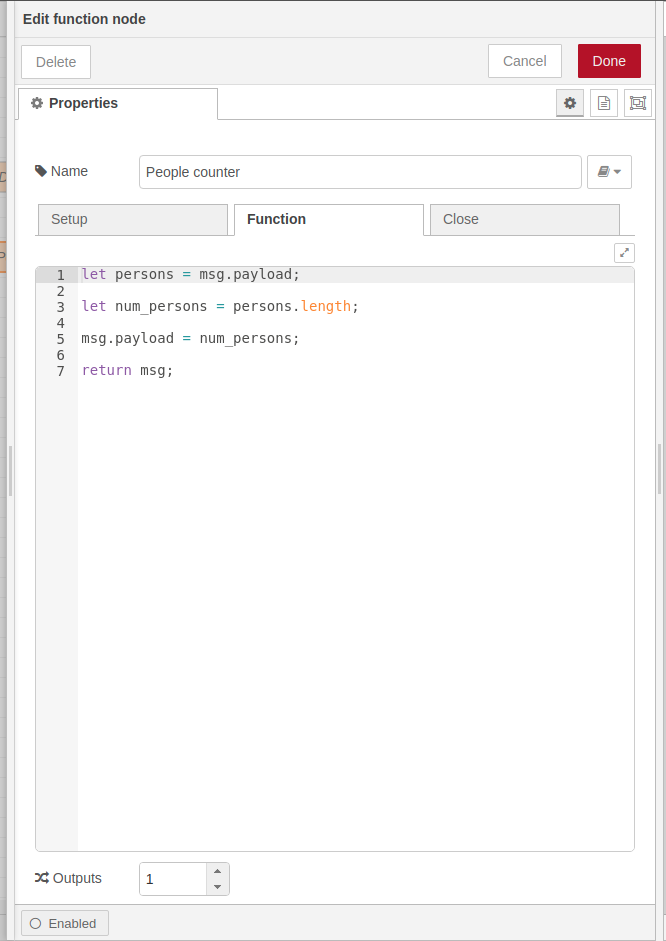
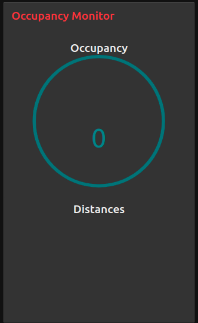

# ADLINK Social Distancing Solution
Using the OpenCV OAK-D camera with ADLINK Edge AI hardware and software to build a social distancing solution. This is driven by a desire to know the occupancy in shared office spaces and whether people are adhering to the distancing guidelines.

## Things used in this project
### Hardware components
- ADLINK Vizi AI
- [Luxonis DepthAI: USB3C with Onboard Cameras](https://shop.luxonis.com/collections/all/products/bw10980bc)

### Software Components
- [ADLINK Edge Profile Builder](https://goto50.ai/?p=831)
- [ADLINK Edge SDK](https://www.adlinktech.com/en/Edge-SDK-IoT)
_ [Node-RED](https://nodered.org/)
- [Luxonis DepthAI Python API](https://docs.luxonis.com/api/)


## Story
As we deal with these unprecedented times organizations are looking at how people can return to physical shared spaces. A common approach to this solution is to use computer vision to monitor the occupancy of shared spaces in schools, offices and retail stores. But with the technology that is currently available we can take this one step further and monitor the distance between people in these shared spaces.

With information about the number of people and the distances between people we can build innovative alerting solutions to notify when good social distancing practices are not being adhered to. The most basic alerting solution is to provide a dashboard with a people counter and distances graph.

## So how did we do it
For this particular solution I decided to use the [Luxonis DepthAI: USB3C](https://shop.luxonis.com/collections/all/products/bw10980bc) camera; it is the basis for the [OpenCV AI Kit OAK-D camera](https://www.kickstarter.com/projects/opencv/opencv-ai-kit) that garnered much attention on Kickstarter. It features three vision sensors, one 4K camera and the other two stereo cameras are used for spacial sensing. And to top it off it includes an Intel MyriadX accelerator that can very efficiently run AI models to turn the unstructured data coming from the cameras into more structured data that we can build solutions such as this one with.

The DepthAI camera doesn't have any general purpose processing capabilities that would let us provide a dashboard, data persistence, cloud connectivity for example. To address this I paired with DepthAI camera with an ADLINK Vizi-AI, which includes an Intel Atom processor and a software stack from ADLINK that eases the process of building solutions such as this one.

In particular we leverage the Node-RED application that is included on the Vizi-AI to process the data that is coming from the DepthAI camera. All of the logic for counting the number of people, the distances between people, and the dashboard is implemented in Node-RED. As you will see it provides a fairly frictionless environment for developing rapid prototypes of solutions (like we are doing here.)

## The devil is in the details
Let's start by turning the cameras on the DepthAI into a source of data by leveraging the on-board MyriadX with `person-detection-retail-0013` model from the OpenCV Model Zoo.

We start with the main entry-point for the DepthAI camera application.

```python
if __name__ == '__main__':
    try:
        args = vars(parse_args())
    except:
        log.error('Problem parsing the command line arguments')
    config = DepthAIConfig(args)
    main = Main(config, 'people')
    main.run()
```

This uses a `DepthAIConfig` class that we have written and that wraps the processing of the DepthAI default values along with the overrides from the command-line. We won't go into the details of it but feel free to browse through it in the accompanying source code repository. The other class we make use of which is speficic to this application is `Main` and the details of it are included below. It is responsible for bridging grabbing data from the DepthAI device and making it available to be used to build solutions by publishing the data through the ADLINK Edge SDK.

```python
class Main:

    def __init__(self, config : DepthAIConfig, model_label : str):
        self.__depthai = DepthAI(config, 'mcclean.home.oakd-1', 'oakd-1', model_label, )
        self.__edge_thing = init_edge_thing()


    def __publish_frame(self, frame, boxes):
        write_tag(self.__edge_thing.thing, 'DetectionBoxData', boxes.dr_data)


    def run(self):
        try:
            log.info('Setup complete, processing frames')
            for frame, results in self.__depthai.capture():
                self.__publish_frame(frame, results)
        finally:
            del self.__depthai
```

Of note in the code above is the `init_edge_thing()` call which instantiates the use of the Edge SDK and enables the call to `write_tag` in `run` which makes the information coming from the DepthAI camera available to other applications to build on-top of. The information is made available has the following schema
```json
[
    {
        "name":"DepthDetectionBox",
        "context":"com.vision.data",
        "qosProfile":"event",
        "version":"v1.0",
        "description":"Inference engine results for object detection model outputing bounding boxes",
        "tags":[
            {
                "name":"engine_id",
                "description":"Inference engine identifier",
                "kind":"STRING",
                "unit":"UUID"
            },
            {
                "name":"stream_id",
                "description":"ID of the stream fed into the inference engine",
                "kind":"STRING",
                "unit":"UUID"
            },
            {
                "name":"frame_id",
                "description":"ID of the input video frame fed to the inference engine",
                "kind":"UINT32",
                "unit":"NUM"
            },
            {
                "name":"data",
                "description":"List of Detection Box Data (the results)",
                "kind":"NVP_SEQ",
                "unit":"n/a",
                "typedefinition": "DepthDetectionBoxData"
            }
        ]
    },
    {
        "typedefinition": "DepthDetectionBoxData",
        "tags": [
            {
                "name":"obj_id",
                "description":"Detected object id",
                "kind":"INT32",
                "unit":"UUID"
            },
            {
                "name":"obj_label",
                "description":"Detected object proper name",
                "kind":"STRING",
                "unit":"UUID"
            },
            {
                "name":"class_id",
                "description":"Detected object's classification type as raw id",
                "kind":"INT32",
                "unit":"UUID"
            },
            {
                "name":"class_label",
                "description":"Detected object's classification as proper name",
                "kind":"STRING",
                "unit":"UUID"
            },
            {
                "name":"x1",
                "description":"Top Left X Coordinate (% from 0,0)",
                "kind":"FLOAT32",
                "unit":"Percentage"
            },
            {
                "name":"y1",
                "description":"Top Left Y Coordinate (% from 0,0)",
                "kind":"FLOAT32",
                "unit":"Percentage"
            },
            {
                "name":"x2",
                "description":"Bottom Right X Coordinate (% from 0,0)",
                "kind":"FLOAT32",
                "unit":"Percentage"
            },
            {
                "name":"y2",
                "description":"Bottom Right Y Coordinate (% from 0,0)",
                "kind":"FLOAT32",
                "unit":"Percentage"
            },
            {
                "name":"probability",
                "description":"Network confidence",
                "kind":"FLOAT32",
                "unit":"Percentage"
            },
            {
                "name":"meta",
                "description":"Buffer for extra inference metadata",
                "kind":"STRING",
                "unit":"N/A"
            },
            {
                "name":"dist_x",
                "description":"The distance on the x-axis",
                "kind":"FLOAT64",
                "unit":"Metres"
            },
            {
                "name":"dist_y",
                "description":"The distance on the y-axis",
                "kind":"FLOAT64",
                "unit":"Metres"
            },
            {
                "name":"dist_z",
                "description":"The distance on the z-axis",
                "kind":"FLOAT64",
                "unit":"Metres"
            }
        ]
    }
]
```

The `DepthAI` class is responsible for managing and acquiring the data from the DepthAI device.

```python
class DepthAI:
    @staticmethod
    def create_pipeline(config):
        if not depthai.init_device(consts.resource_paths.device_cmd_fpath):
            log.error('Failed to initialize device raising a RuntimeError')
            raise RuntimeError('Error initializing device. Try to reset it.')
        log.info('Creating DepthAI pipeline...')

        pipeline = depthai.create_pipeline(config)
        if pipeline is None:
            log.error('Failed to create pipeline raising a RuntimeError.')
            raise RuntimeError('Pipeline was not created.')

        log.info('Pipeline created successfully.')
        return pipeline

    def __init__(self, config:DepthAIConfig, stream_id : str,
                 engine_id : str, model_label: str,
                 threshold : float = 0.5):
        self.__config = config
        self.__pipeline = DepthAI.create_pipeline(config.config)
        self.__network_results = []
        self.__threshold = threshold
        self.__model_label = model_label
        self.__labels = config.labels
        self.__engine_id = engine_id
        self.__stream_id = stream_id


    def capture(self):
        frame_num = 0
        while True:
            nnet_packets, data_packets = self.__pipeline.get_available_nnet_and_data_packets()
            for _, nnet_packet in enumerate(nnet_packets):
                self.__network_results = []
                for _, e in enumerate(nnet_packet.entries()):
                    if e[0]['id'] == -1.0 or e[0]['confidence'] < self.__threshold:
                        break

                    self.__network_results.append(e[0])
            for packet in data_packets:
                if packet.stream_name == 'previewout':
                    boxes = PyDepthDetectionBox()
                    boxes.stream_id = 'foo'
                    boxes.engine_id = 'engine'
                    boxes.frame_id = frame_num
                    data = packet.getData()
                    if data is None:
                        continue
                    data0 = data[0,:,:]
                    data1 = data[1, :, :]
                    data2 = data[2, :, :]
                    frame = cv2.merge([data0, data1, data2])

                    img_h = frame.shape[0]
                    img_w = frame.shape[1]

                    for e in self.__network_results:
                        try:
                            box = PyDepthDetectionBoxData()
                            box.x1 = float(e['left'])
                            box.y1 = float(e['top'])
                            box.x2 = float(e['right'])
                            box.y2 = float(e['bottom'])
                            box.class_id = e['label']
                            if box.class_id <= len(self.__labels):
                                box.class_label = self.__labels[box.class_id]
                            box.probability = e['confidence']
                            box.dist_x = e['distance_x']
                            box.dist_y = e['distance_y']
                            box.dist_z = e['distance_z']
                            boxes.add_data(box)
                        except :
                            continue
                    yield frame, boxes
                    frame_num += 1


    def __del__(self):
        del self.__pipeline
        depthai.deinit_device()
```

Finally, the completion of the solution we use Node-RED. The flow is subscribes to the ADLINK Data River (which we published the DepthAI camera information to in the previous step) in the `DetectionBox_Reader` node. The subscription results in a stream of detection boxes that can be processed in the rest of the flow.

The detailed configuration of the `DetectionBox_Reader` node.



The next step is to filter out all of the detection boxes that are not for the `person` class. The filtering is done in the `Extract Inferenced Objects` node.



Now that we have only a list of detected people we can calculate the distance between them in the `Calculate Distances Between People` node. The result of this node flow into a dashboard graph node that will show the distances between people in a bar chart.



We can also to a simple count of the number of people detected in the `People Counter` node. The result flows into a gauge that shows the number of people detected.



And finally we get a dashboard that looks like the following.



## Wrap-up

We have our occupancy monitor that runs completely at the edge by combining Luxonis and ADLINK technology. The next steps would be to use the Azure IoT or AWS IoT connectors that ADLINK provides to be able to send the processed data to the cloud so that a fleet of these solutions can be remotely monitored.